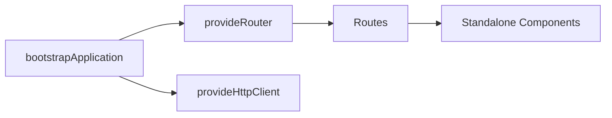

unit: 1
topic: Angular Recap & Project Setup
objectives: ["Understand the core ideas of Angular Recap & Project Setup","Implement a working example related to Angular Recap & Project Setup","Apply best practices and avoid common mistakes in Angular Recap & Project Setup","Use Angular 17 patterns effectively"]
difficulty: Intermediate
---

# Angular 17 Recap & Project Setup

## Learning Objectives

- Set up an Angular 17 app with standalone architecture
- Use Vite-based dev server and esbuild builder
- Configure routing, HttpClient, and application providers
- Apply new template control flow and signals fundamentals

## Overview

- Angular 17 defaults to standalone components, Vite dev server, and esbuild builds
- Application-level configuration uses `bootstrapApplication` and `ApplicationConfig`
- Core concepts: components, templates, dependency injection, routing, HttpClient, signals

## Key Concepts

- Standalone components replace NgModules for most apps
- Router configured via `provideRouter` and route definitions
- HttpClient provided via `provideHttpClient`
- Built-in control flow: `@if`, `@for`, `@switch`, `@defer`
- Signals provide reactive state primitives alongside RxJS

## Code Examples

### Create Project

```bash
ng new angular17-app --routing --style=scss
cd angular17-app
ng serve
```

### Bootstrap and Routing

```ts
// main.ts
import { bootstrapApplication } from '@angular/platform-browser';
import { provideRouter, Routes } from '@angular/router';
import { provideHttpClient } from '@angular/common/http';
import { AppComponent } from './app/app.component';

const routes: Routes = [
  { path: '', loadComponent: () => import('./app/home.component').then(m => m.HomeComponent) },
  { path: 'about', loadComponent: () => import('./app/about.component').then(m => m.AboutComponent) }
];

bootstrapApplication(AppComponent, {
  providers: [provideRouter(routes), provideHttpClient()]
});
```

### Standalone Component with Control Flow

```ts
// app/home.component.ts
import { Component, signal } from '@angular/core';

@Component({
  selector: 'app-home',
  standalone: true,
  template: `
    <h2>Home</h2>
    @if(count() > 0){
      <p>Count: {{ count() }}</p>
    } @else {
      <p>No count yet</p>
    }
    <button (click)="inc()">Increment</button>
  `
})
export class HomeComponent {
  count = signal(0);
  inc(){ this.count.set(this.count() + 1); }
}
```

## Practical Exercises

### Exercise

- Generate a new component and add it as a lazy route
- Provide `HttpClient` and fetch JSON from a public API

### Solution

```bash
ng g component app/about --standalone
```

```ts
// app/about.component.ts
import { Component } from '@angular/core';

@Component({
  selector: 'app-about',
  standalone: true,
  template: `<h2>About</h2>`
})
export class AboutComponent {}
```

```ts
// main.ts (routes already shown)
```

```ts
// app/home.component.ts (add HTTP usage)
import { Component, inject } from '@angular/core';
import { HttpClient } from '@angular/common/http';

@Component({
  selector: 'app-home',
  standalone: true,
  template: `
    <h2>Home</h2>
    <pre>{{ data | json }}</pre>
  `
})
export class HomeComponent {
  http = inject(HttpClient);
  data: unknown;
  constructor(){
    this.http.get('https://api.github.com').subscribe(r => this.data = r);
  }
}
```

## Diagram



## Troubleshooting & Pitfalls

- Use Node 18+ and Angular CLI 17 to avoid version mismatches
- Ensure routes use `loadComponent` for standalone lazy loading
- Provide shared services via application `providers` to avoid duplicate instances
- Prefer built-in control flow over legacy `*ngIf`/`*ngFor` for new code

## References

- https://angular.dev/guide/standalone-components
- https://angular.dev/guide/router
- https://angular.dev/guide/template-syntax
- https://angular.dev/guide/signals
