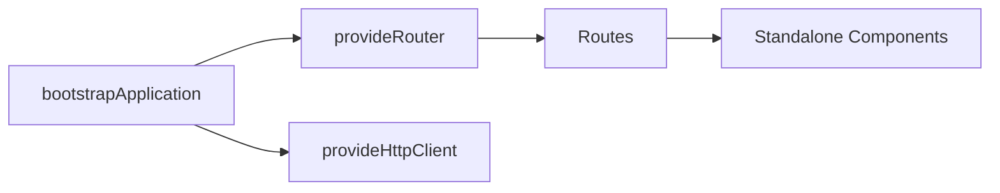

# Unit: 1 - Angular 17 Recap & Project Setup

## Learning Objectives

- Set up an Angular 17 app with standalone architecture
- Use Vite-based dev server and esbuild builder
- Configure routing, HttpClient, and application providers
- Apply new template control flow and signals fundamentals

## Syllabus Requirement

- Angular 17 is required as per the course syllabus. All commands and steps below explicitly install and verify Angular CLI 17.

## Prerequisites

- Verify Node.js compatibility

```bash
node -v
npm -v
```

Expected (examples):

```text
v18.18.0  # Recommended: Node 18.13+ or Node 20.x
10.2.0    # npm version example
```

- Check for existing Angular CLI installations

```bash
where ng        # Windows
npm ls -g @angular/cli --depth=0
```

Example outputs:

```text
C:\Users\admin\AppData\Roaming\npm\ng
@angular/cli@16.2.12
```

## Installation

- npm (recommended)

```bash
npm i -g @angular/cli@17
```

- pnpm

```bash
pnpm add -g @angular/cli@17
```

- yarn (Classic)

```bash
yarn global add @angular/cli@17
```

- No global install (use one-off execution)

```bash
npx -p @angular/cli@17 ng version
```

## Version Management

- Check the currently installed version

```bash
ng version
```

Expected snippet:

```text
Angular CLI: 17.x.x
Node: v18.x or v20.x
Package Manager: npm
```

- Uninstall any existing global Angular CLI

```bash
npm uninstall -g @angular/cli
where ng
```

If `where ng` still shows paths, remove residual shims:

```powershell
Remove-Item "$env:AppData\npm\ng*" -Force -ErrorAction SilentlyContinue
```

Clear npm cache and confirm prefix/bin is in PATH:

```bash
npm cache verify
npm prefix -g
```

Ensure `%AppData%\npm` is present in the system/user PATH on Windows.

- Clean install Angular CLI 17

```bash
npm i -g @angular/cli@17
ng version
```

- Prefer local per-project CLI to avoid global conflicts (optional)

```bash
npm i -D @angular/cli@17
npx ng version
```

## Verification

- Confirm installation

```bash
ng version
```

Example output:

```text
Angular CLI: 17.3.9
Node: 20.11.1
Package Manager: npm 10.5.0
OS: win32 x64
```

- Basic functionality checks

```bash
ng help
ng new --help
ng generate --help
```

- Quick test project

```bash
ng new cli17-test --routing --style=scss --skip-tests=false
cd cli17-test
ng serve
```

Expected dev server output (abridged):

```text
✔ Browser application bundle generation complete.
✔ Vite server running at: http://localhost:4200/
```

## Project Setup

- Create an Angular 17 project (standalone by default)

```bash
ng new angular17-app --routing --style=scss
cd angular17-app
ng serve
```

- Recommended structure (Angular 17 best practices)

```text
angular17-app/
  src/
    app/
      app.component.ts        # Root standalone component
      app.config.ts           # ApplicationConfig (providers, router)
      home.component.ts       # Feature standalone component
    main.ts                   # bootstrapApplication(AppComponent)
  package.json
  angular.json
```

- Minimal `main.ts` and routing via `ApplicationConfig`

```ts
// main.ts
import { bootstrapApplication } from '@angular/platform-browser';
import { AppComponent } from './app/app.component';
import { appConfig } from './app/app.config';

bootstrapApplication(AppComponent, appConfig);
```

```ts
// app/app.config.ts
import { ApplicationConfig } from '@angular/core';
import { provideRouter, Routes } from '@angular/router';
import { provideHttpClient } from '@angular/common/http';

const routes: Routes = [
  { path: '', loadComponent: () => import('./home.component').then(m => m.HomeComponent) }
];

export const appConfig: ApplicationConfig = {
  providers: [provideRouter(routes), provideHttpClient()]
};
```

## Overview

- Angular 17 defaults to standalone components, Vite dev server, and esbuild builds
- Application-level configuration uses `bootstrapApplication` and `ApplicationConfig`
- Core concepts: components, templates, dependency injection, routing, HttpClient, signals

## Key Concepts

- Standalone components replace NgModules for most apps
- Router configured via `provideRouter` and route definitions
- HttpClient provided via `provideHttpClient`
- Built-in control flow: `@if`, `@for`, `@switch`, `@defer`
- Signals provide reactive state primitives alongside RxJS

## Code Examples

### Create Project

```bash
ng new angular17-app --routing --style=scss
cd angular17-app
ng serve
```

### Bootstrap and Routing

```ts
// main.ts
import { bootstrapApplication } from '@angular/platform-browser';
import { provideRouter, Routes } from '@angular/router';
import { provideHttpClient } from '@angular/common/http';
import { AppComponent } from './app/app.component';

const routes: Routes = [
  { path: '', loadComponent: () => import('./app/home.component').then(m => m.HomeComponent) },
  { path: 'about', loadComponent: () => import('./app/about.component').then(m => m.AboutComponent) }
];

bootstrapApplication(AppComponent, {
  providers: [provideRouter(routes), provideHttpClient()]
});
```

### Standalone Component with Control Flow

```ts
// app/home.component.ts
import { Component, signal } from '@angular/core';

@Component({
  selector: 'app-home',
  standalone: true,
  template: `
    <h2>Home</h2>
    @if(count() > 0){
      <p>Count: {{ count() }}</p>
    } @else {
      <p>No count yet</p>
    }
    <button (click)="inc()">Increment</button>
  `
})
export class HomeComponent {
  count = signal(0);
  inc(){ this.count.set(this.count() + 1); }
}
```

## Practical Exercises

### Exercise

- Generate a new component and add it as a lazy route
- Provide `HttpClient` and fetch JSON from a public API

### Solution

```bash
ng g component app/about --standalone
```

```ts
// app/about.component.ts
import { Component } from '@angular/core';

@Component({
  selector: 'app-about',
  standalone: true,
  template: `<h2>About</h2>`
})
export class AboutComponent {}
```

```ts
// main.ts (routes already shown)
```

```ts
// app/home.component.ts (add HTTP usage)
import { Component, inject } from '@angular/core';
import { HttpClient } from '@angular/common/http';

@Component({
  selector: 'app-home',
  standalone: true,
  template: `
    <h2>Home</h2>
    <pre>{{ data | json }}</pre>
  `
})
export class HomeComponent {
  http = inject(HttpClient);
  data: unknown;
  constructor(){
    this.http.get('https://api.github.com').subscribe(r => this.data = r);
  }
}
```

## Diagram



## Troubleshooting & Pitfalls

- `ng` not recognized on Windows

```text
Fix: Add %AppData%\npm to PATH, then reopen PowerShell.
Check: where ng
```

- Version mismatch (CLI 16 with Angular 17 project)

```text
Fix: npm uninstall -g @angular/cli && npm i -g @angular/cli@17
Or: use npx -p @angular/cli@17 ng <command>
```

- Permission or prefix issues

```bash
npm prefix -g
```

Ensure the printed global prefix contains `AppData\Roaming\npm` and is in PATH.

- Proxy/corporate network errors

```bash
npm config set registry https://registry.npmjs.org
```

- Node version conflicts

```text
Use nvm-windows to install Node 18.18+ or 20.x and switch as needed.
```

## References

- https://angular.dev/guide/standalone-components
- https://angular.dev/guide/router
- https://angular.dev/guide/template-syntax
- https://angular.dev/guide/signals
