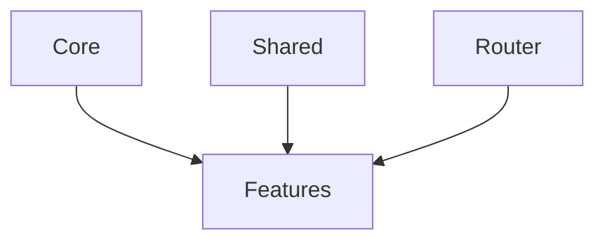

# Folder Structure and Organization (Standalone)

## Learning Objectives

- Organize large Angular 17 apps using feature-first folders
- Separate `core` and `shared` concerns for reuse
- Implement lazy-loaded feature areas with standalone components

## Overview

- Favor feature-first structure with clear boundaries
- Keep `core` singletons and cross-cutting services isolated
- Share UI primitives and utilities via `shared`

## Recommended Layout

```text
app/
  core/
    services/
    guards/
    interceptors/
  shared/
    ui/
    directives/
    pipes/
  features/
    auth/
    dashboard/
    orders/
  app.component.ts
  app.routes.ts
```

## Example: Feature Area

```ts
import { Component } from '@angular/core';

@Component({
  selector: 'app-orders',
  standalone: true,
  template: `
    <h2>Orders</h2>
  `
})
export class OrdersComponent {}
```

```ts
import { Routes } from '@angular/router';

export const routes: Routes = [
  { path: 'orders', loadComponent: () => import('./features/orders/orders.component').then(m => m.OrdersComponent) }
];
```

## Practical Exercises

### Exercise

- Create `features/auth` and `features/dashboard` and lazy-load both
- Move common buttons into `shared/ui` and reuse them

### Solution

```bash
ng g component app/features/auth --standalone
ng g component app/features/dashboard --standalone
```

## Diagram



## Troubleshooting & Pitfalls

- Avoid importing feature components directly in other features; use routes
- Keep `shared` stateless to prevent unintended singleton usage
- Prevent circular imports across features

## References

- https://angular.dev/guide/standalone-components
- https://angular.dev/guide/router
