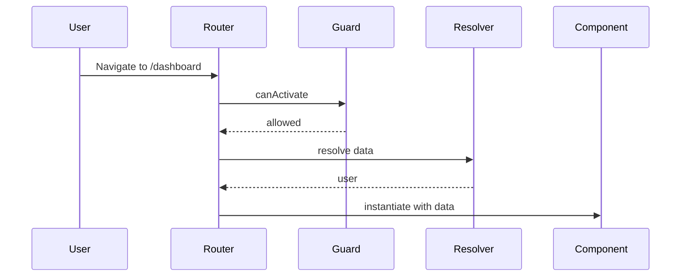

## Learning Objectives

- Implement lazy routes, guards, and resolvers
- Handle router events and route state with RxJS
- Use signals and control flow in templates

## Overview

- Router supports lazy loading via `loadComponent` and functional guards
- Route data and params drive application state
- RxJS and signals can be combined to manage state reactively

## Key Concepts

- Functional `canActivate`, `canDeactivate`, and resolvers
- `Router` and `ActivatedRoute` for navigation and state
- Preloading strategies and `@defer` for view-level lazy loading

## Code Examples

### Routes with Guard and Resolver

```ts
import { Routes } from '@angular/router';
import { inject } from '@angular/core';
import { HttpClient } from '@angular/common/http';

export const authGuard = () => !!localStorage.getItem('token');

export const userResolver = () => inject(HttpClient).get('/api/me');

export const routes: Routes = [
  {
    path: 'dashboard',
    canActivate: [authGuard],
    resolve: { user: userResolver },
    loadComponent: () => import('./features/dashboard/dashboard.component').then(m => m.DashboardComponent)
  }
];
```

### Route State with RxJS

```ts
import { Component, inject } from '@angular/core';
import { ActivatedRoute, Router } from '@angular/router';
import { map } from 'rxjs/operators';

@Component({
  selector: 'app-dashboard',
  standalone: true,
  template: `
    <h2>Dashboard</h2>
    <p>{{ userName$ | async }}</p>
    <button (click)="goHome()">Home</button>
  `
})
export class DashboardComponent {
  route = inject(ActivatedRoute);
  router = inject(Router);
  userName$ = this.route.data.pipe(map(d => d['user']?.name));
  goHome(){ this.router.navigateByUrl('/'); }
}
```

### Template-Level Lazy with `@defer`

```ts
import { Component } from '@angular/core';

@Component({
  selector: 'app-heavy',
  standalone: true,
  template: `
    @defer{
      <lazy-chart></lazy-chart>
    } @placeholder {
      <p>Loading chart...</p>
    }
  `
})
export class HeavyComponent {}
```

## Practical Exercises

### Exercise

- Add `orders` route protected by `authGuard`
- Resolve `orders` via `HttpClient` and render list

### Solution

```ts
export const ordersResolver = () => inject(HttpClient).get('/api/orders');
```

```ts
export const routes: Routes = [
  {
    path: 'orders',
    canActivate: [authGuard],
    resolve: { orders: ordersResolver },
    loadComponent: () => import('./features/orders/orders.component').then(m => m.OrdersComponent)
  }
];
```

## Diagram



## Troubleshooting & Pitfalls

- Return truthy/falsey in functional guards; redirect using `Router` when denied
- Resolvers must complete; handle errors and provide fallback data
- Avoid heavy work in route constructors; use resolvers and `@defer`

## References

- https://angular.dev/guide/router
- https://angular.dev/guide/router/guards
- https://angular.dev/guide/router/resolvers
- https://angular.dev/guide/template-syntax#defer
