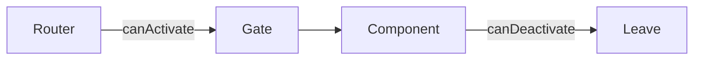

## Learning Objectives

- Protect routes with functional guards
- Handle pending changes with `canDeactivate`
- Redirect unauthenticated users

## Overview

- Functional guards in Angular 17 use plain functions and `inject`
- `canDeactivate` prompts users before leaving a dirty form

## Code Examples

### CanActivate

```ts
import { Routes, Router } from '@angular/router';
import { inject } from '@angular/core';

export const authGuard = () => {
  const router = inject(Router);
  const ok = !!localStorage.getItem('token');
  if(!ok){ router.navigateByUrl('/login'); }
  return ok;
};

export const routes: Routes = [
  { path: 'profile', canActivate: [authGuard], loadComponent: () => import('./profile.component').then(m => m.ProfileComponent) }
];
```

### CanDeactivate

```ts
import { CanDeactivateFn } from '@angular/router';

export interface DirtyAware { isDirty(): boolean; }

export const pendingChangesGuard: CanDeactivateFn<DirtyAware> = (component) => {
  return component.isDirty() ? confirm('Discard changes?') : true;
};

export const routes: Routes = [
  { path: 'edit', canDeactivate: [pendingChangesGuard], loadComponent: () => import('./edit.component').then(m => m.EditComponent) }
];
```

## Practical Exercises

### Exercise

- Add `authGuard` to `orders` route
- Implement `pendingChangesGuard` for `edit-order`

### Solution

```ts
export const routes: Routes = [
  { path: 'orders', canActivate: [authGuard], loadComponent: () => import('./orders.component').then(m => m.OrdersComponent) },
  { path: 'edit-order/:id', canDeactivate: [pendingChangesGuard], loadComponent: () => import('./edit-order.component').then(m => m.EditOrderComponent) }
];
```

## Diagram



## Troubleshooting & Pitfalls

- Guards should be pure and fast; avoid heavy async work
- Always handle the unauthenticated path with redirects
- Implement `isDirty()` deterministically to prevent accidental navigation

## References

- https://angular.dev/guide/router/guards
