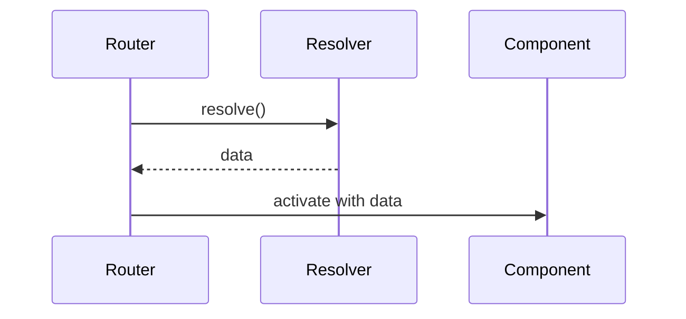

## Learning Objectives

- Preload data with functional resolvers
- Use `ActivatedRoute.data` in components
- Handle resolver errors gracefully

## Overview

- Resolvers run before route activation and provide data to components
- Functional resolvers use `inject` to access services

## Code Examples

### Functional Resolver

```ts
import { inject } from '@angular/core';
import { HttpClient } from '@angular/common/http';

export const productsResolver = () => inject(HttpClient).get('/api/products');
```

### Route Configuration

```ts
import { Routes } from '@angular/router';

export const routes: Routes = [
  {
    path: 'products',
    resolve: { products: productsResolver },
    loadComponent: () => import('./features/products/products.component').then(m => m.ProductsComponent)
  }
];
```

### Using Resolver Data

```ts
import { Component, inject } from '@angular/core';
import { ActivatedRoute } from '@angular/router';

@Component({
  selector: 'app-products',
  standalone: true,
  template: `
    <h2>Products</h2>
    @for(p of products; track p.id){
      <p>{{ p.name }}</p>
    }
  `
})
export class ProductsComponent {
  products = inject(ActivatedRoute).snapshot.data['products'] || [];
}
```

## Practical Exercises

### Exercise

- Add `categoriesResolver` and render categories with products

### Solution

```ts
export const categoriesResolver = () => inject(HttpClient).get('/api/categories');
```

```ts
export const routes: Routes = [
  {
    path: 'products',
    resolve: { products: productsResolver, categories: categoriesResolver },
    loadComponent: () => import('./features/products/products.component').then(m => m.ProductsComponent)
  }
];
```

## Diagram



## Troubleshooting & Pitfalls

- Resolvers must complete; provide fallback values on error
- Prefer resolvers for required data; use lazy `@defer` for non-critical UI
- Avoid side effects in resolvers; fetch and return only

## References

- https://angular.dev/guide/router/resolvers
