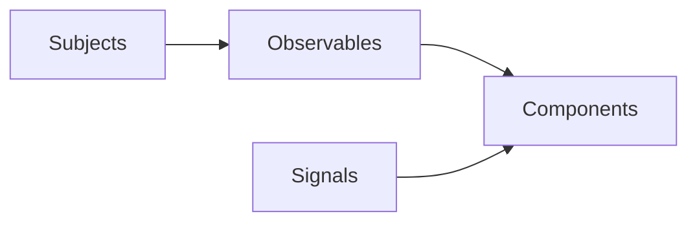

# Advanced State Handling with RxJS Subjects

## Learning Objectives

- Model state with RxJS subjects
- Bridge RxJS state into templates
- Compare RxJS with Angular signals

## Overview

- Subjects provide multicasting and push-based state
- `BehaviorSubject` stores the latest value for late subscribers
- Signals offer an alternative for local component state

## Code Examples

### Subject and BehaviorSubject

```ts
import { Subject, BehaviorSubject } from 'rxjs';

const events$ = new Subject<string>();
const count$ = new BehaviorSubject<number>(0);

events$.subscribe(x => console.log(x));
count$.subscribe(x => console.log(count$));

events$.next('loaded');
count$.next(1);
```

### Angular Service with Subjects

```ts
import { Injectable } from '@angular/core';
import { BehaviorSubject } from 'rxjs';

@Injectable({ providedIn: 'root' })
export class StoreService {
  private count$ = new BehaviorSubject<number>(0);
  selectCount(){ return this.count$.asObservable(); }
  increment(){ this.count$.next(this.count$.value + 1); }
}
```

### Component consuming RxJS state

```ts
import { Component, inject } from '@angular/core';
import { StoreService } from './store.service';

@Component({
  selector: 'app-counter',
  standalone: true,
  template: `
    <h3>Counter</h3>
    <p>{{ count$ | async }}</p>
    <button (click)="inc()">Increment</button>
  `
})
export class CounterComponent {
  store = inject(StoreService);
  count$ = this.store.selectCount();
  inc(){ this.store.increment(); }
}
```

### Signals vs RxJS

```ts
import { Component, signal, computed } from '@angular/core';

@Component({
  selector: 'app-signal-counter',
  standalone: true,
  template: `
    <p>{{ doubled() }}</p>
    <button (click)="inc()">Increment</button>
  `
})
export class SignalCounterComponent {
  count = signal(0);
  doubled = computed(() => this.count() * 2);
  inc(){ this.count.set(this.count() + 1); }
}
```

## Practical Exercises

### Exercise

- Build a `TodoService` using `BehaviorSubject` and list todos
- Add a filter Subject and combine streams for filtered view

### Solution

```ts
import { BehaviorSubject, combineLatest } from 'rxjs';
import { map } from 'rxjs/operators';

class TodoService {
  private todos$ = new BehaviorSubject<Array<{id:number; text:string; done:boolean}>>([]);
  filter$ = new BehaviorSubject<'all'|'done'|'pending'>('all');
  view$ = combineLatest([this.todos$, this.filter$]).pipe(
    map(([todos, f]) => f === 'all' ? todos : todos.filter(t => f === 'done' ? t.done : !t.done))
  );
}
```

## Diagram



## Troubleshooting & Pitfalls

- Avoid memory leaks; use `async` pipe or take operators
- Prefer `asObservable()` to encapsulate writable subjects
- Use `shareReplay` for caching when needed

## References

- https://angular.dev/guide/rxjs
- https://rxjs.dev/guide/overview
