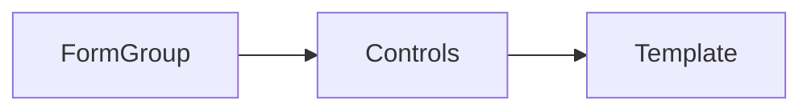

## Learning Objectives

- Build typed reactive forms
- Validate and display errors consistently
- Integrate forms with APIs and state

## Overview

- Reactive forms provide explicit, immutable state management
- Typed forms improve safety and DX

## Code Examples

### Typed Form Setup

```ts
import { Component } from '@angular/core';
import { FormBuilder, Validators } from '@angular/forms';

type LoginForm = {
  email: string;
  password: string;
};

@Component({
  selector: 'app-login',
  standalone: true,
  template: `
    <form [formGroup]="form" (ngSubmit)="submit()">
      <input formControlName="email" />
      <input formControlName="password" type="password" />
      <button type="submit">Login</button>
    </form>
    @if(form.invalid){
      <p>Form invalid</p>
    }
  `
})
export class LoginComponent {
  fb = new FormBuilder();
  form = this.fb.nonNullable.group<LoginForm>({
    email: ['', [Validators.required, Validators.email]],
    password: ['', [Validators.required, Validators.minLength(6)]]
  });
  submit(){ if(this.form.valid){ console.log(this.form.value); } }
}
```

### FormArray Example

```ts
import { Component } from '@angular/core';
import { FormArray, FormBuilder, Validators } from '@angular/forms';

@Component({
  selector: 'app-tags',
  standalone: true,
  template: `
    <form [formGroup]="form">
      <div formArrayName="tags">
        @for(tag of tags.controls; track $index){
          <input [formControlName]="$index" />
        }
      </div>
      <button (click)="add()">Add Tag</button>
    </form>
  `
})
export class TagsComponent {
  fb = new FormBuilder();
  form = this.fb.group({ tags: this.fb.array<string>([]) });
  get tags(){ return this.form.get('tags') as FormArray; }
  add(){ this.tags.push(this.fb.control('', Validators.required)); }
}
```

## Practical Exercises

### Exercise

- Build a registration form with validation and disable submit until valid
- Show error messages under each control

### Solution

```ts
import { Component } from '@angular/core';
import { FormBuilder, Validators } from '@angular/forms';

@Component({
  selector: 'app-register',
  standalone: true,
  template: `
    <form [formGroup]="form" (ngSubmit)="submit()">
      <input formControlName="name" />
      <div>{{ form.get('name')?.errors | json }}</div>
      <input formControlName="email" />
      <div>{{ form.get('email')?.errors | json }}</div>
      <button [disabled]="form.invalid" type="submit">Register</button>
    </form>
  `
})
export class RegisterComponent {
  fb = new FormBuilder();
  form = this.fb.group({
    name: ['', Validators.required],
    email: ['', [Validators.required, Validators.email]]
  });
  submit(){ if(this.form.valid){ console.log(this.form.value); } }
}
```

## Diagram



## Troubleshooting & Pitfalls

- Prefer typed forms via `nonNullable` group for safety
- Avoid direct mutation of form values; use `patchValue`
- Use `statusChanges` and `valueChanges` to react to form changes

## References

- https://angular.dev/guide/forms/reactive-forms
- https://angular.dev/guide/forms/validation
