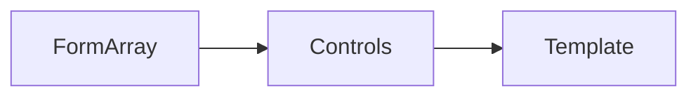

# Dynamic Form Generation with FormArray

## Learning Objectives

- Build dynamic forms with `FormArray`
- Add and remove rows with validation
- Render arrays with built-in control flow

## Overview

- `FormArray` manages homogeneous lists of controls
- Use indices and track logic to render and update items

## Code Examples

### Dynamic Rows

```ts
import { Component } from '@angular/core';
import { FormArray, FormBuilder, Validators } from '@angular/forms';

@Component({
  selector: 'app-addresses',
  standalone: true,
  template: `
    <form [formGroup]="form">
      <div formArrayName="addresses">
        @for(ctrl of addresses.controls; track $index){
          <div>
            <input [formControlName]="$index" placeholder="Address" />
            <button (click)="remove($index)">Remove</button>
          </div>
        }
      </div>
      <button (click)="add()">Add Address</button>
    </form>
  `
})
export class AddressesComponent {
  fb = new FormBuilder();
  form = this.fb.group({ addresses: this.fb.array<string>([]) });
  get addresses(){ return this.form.get('addresses') as FormArray; }
  add(){ this.addresses.push(this.fb.control('', Validators.required)); }
  remove(i: number){ this.addresses.removeAt(i); }
}
```

## Practical Exercises

### Exercise

- Add validation messages and disable submit until all addresses are valid

### Solution

```ts
@Component({
  selector: 'app-addresses',
  standalone: true,
  template: `
    <form [formGroup]="form" (ngSubmit)="submit()">
      <div formArrayName="addresses">
        @for(ctrl of addresses.controls; track $index){
          <div>
            <input [formControlName]="$index" />
            @if(ctrl.invalid && ctrl.touched){
              <small>Required</small>
            }
          </div>
        }
      </div>
      <button [disabled]="form.invalid" type="submit">Submit</button>
    </form>
  `
})
export class AddressesComponent {
  submit(){ console.log(this.form.value); }
}
```

## Diagram



## Troubleshooting & Pitfalls

- Always access `FormArray` via getter for readability
- Use `Validators` on controls to enforce required fields
- Track by index for `@for` when items are primitive

## References

- https://angular.dev/guide/forms/reactive-forms
