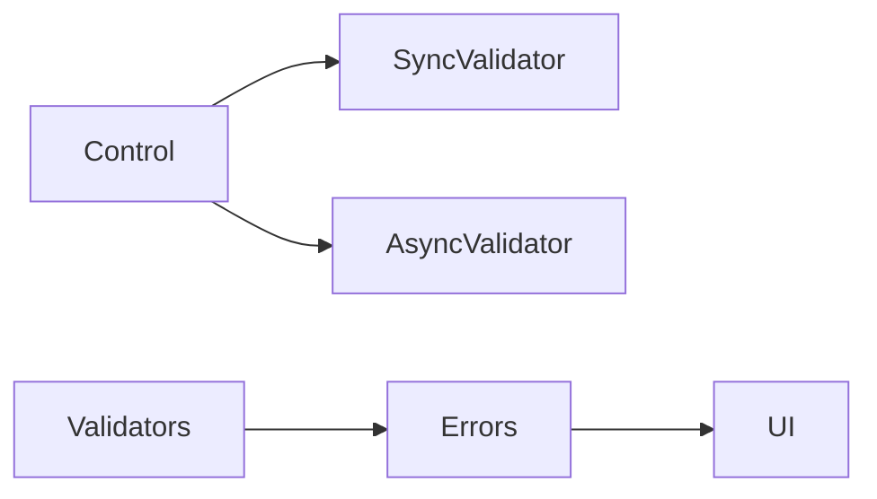

# Custom Validators and Async Validation

## Learning Objectives

- Build custom synchronous and asynchronous validators
- Display control-level error messages
- Prevent submission until valid

## Overview

- Validators are pure functions returning error maps or `null`
- Async validators return `Observable<ValidationErrors|null>`

## Code Examples

### Custom Synchronous Validator

```ts
import { AbstractControl, ValidationErrors } from '@angular/forms';

export function strongPassword(c: AbstractControl): ValidationErrors | null {
  const v = c.value as string;
  const ok = /[A-Z]/.test(v) && /[0-9]/.test(v) && v?.length >= 8;
  return ok ? null : { strongPassword: true };
}
```

### Async Validator

```ts
import { Injectable } from '@angular/core';
import { HttpClient } from '@angular/common/http';
import { AsyncValidatorFn, AbstractControl, ValidationErrors } from '@angular/forms';
import { map, catchError, of } from 'rxjs';

@Injectable({ providedIn: 'root' })
export class UsernameValidator {
  constructor(private http: HttpClient) {}
  unique(): AsyncValidatorFn {
    return (c: AbstractControl) => this.http.get<{available:boolean}>(`/api/users/available?u=${c.value}`)
      .pipe(
        map(r => r.available ? null : { usernameTaken: true }),
        catchError(() => of(null))
      );
  }
}
```

### Form Usage

```ts
import { Component, inject } from '@angular/core';
import { FormBuilder, Validators } from '@angular/forms';
import { UsernameValidator } from './username.validator';
import { strongPassword } from './password.validator';

@Component({
  selector: 'app-signup',
  standalone: true,
  template: `
    <form [formGroup]="form" (ngSubmit)="submit()">
      <input formControlName="username" />
      <small>{{ form.get('username')?.errors | json }}</small>
      <input type="password" formControlName="password" />
      <small>{{ form.get('password')?.errors | json }}</small>
      <button [disabled]="form.invalid">Sign Up</button>
    </form>
  `
})
export class SignupComponent {
  fb = new FormBuilder();
  usernameValidator = inject(UsernameValidator);
  form = this.fb.group({
    username: ['', [Validators.required], [this.usernameValidator.unique()]],
    password: ['', [Validators.required, strongPassword]]
  });
  submit(){ console.log(this.form.value); }
}
```

## Practical Exercises

### Exercise

- Add email control with async validator checking server uniqueness
- Show a global error message when any control is invalid

### Solution

```ts
form = this.fb.group({
  username: ['', [Validators.required], [this.usernameValidator.unique()]],
  email: ['', [Validators.required, Validators.email]],
  password: ['', [Validators.required, strongPassword]]
});
```

## Diagram



## Troubleshooting & Pitfalls

- Keep validators pure and side-effect free
- Debounce async validation on text inputs at the component level when needed
- Avoid server calls on empty values in async validators

## References

- https://angular.dev/guide/forms/validation
