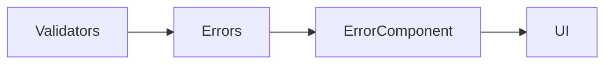

# Centralized Form Error Handling

## Learning Objectives

- Centralize form error messages
- Render consistent UI for validation across controls
- Encapsulate error logic in reusable components

## Overview

- Map validation keys to user-friendly messages
- Create a generic error component for forms

## Code Examples

### Error Map

```ts
export const ERROR_MESSAGES: Record<string,string> = {
  required: 'This field is required',
  email: 'Enter a valid email address',
  minlength: 'Too short',
  usernameTaken: 'Username is already taken',
  strongPassword: 'Use at least 8 chars, a number and an uppercase letter'
};
```

### Error Component

```ts
import { Component, Input } from '@angular/core';
import { AbstractControl } from '@angular/forms';
import { NgIf, NgFor } from '@angular/common';
import { ERROR_MESSAGES } from './error-messages';

@Component({
  selector: 'app-errors',
  standalone: true,
  imports: [NgIf, NgFor],
  template: `
    @if(control && control.invalid && (control.dirty || control.touched)){
      @for(key of keys(); track key){
        <small>{{ message(key) }}</small>
      }
    }
  `
})
export class ErrorsComponent {
  @Input() control?: AbstractControl | null;
  keys(){ return Object.keys(this.control?.errors || {}); }
  message(k: string){ return ERROR_MESSAGES[k] || k; }
}
```

### Usage in Form Template

```ts
import { Component } from '@angular/core';
import { FormBuilder, Validators } from '@angular/forms';
import { ErrorsComponent } from './errors.component';

@Component({
  selector: 'app-login',
  standalone: true,
  imports: [ErrorsComponent],
  template: `
    <form [formGroup]="form" (ngSubmit)="submit()">
      <input formControlName="email" />
      <app-errors [control]="form.get('email')"></app-errors>
      <input type="password" formControlName="password" />
      <app-errors [control]="form.get('password')"></app-errors>
      <button [disabled]="form.invalid">Login</button>
    </form>
  `
})
export class LoginComponent {
  fb = new FormBuilder();
  form = this.fb.group({
    email: ['', [Validators.required, Validators.email]],
    password: ['', [Validators.required]]
  });
  submit(){ console.log(this.form.value); }
}
```

## Practical Exercises

### Exercise

- Extend the error map to include `maxLength` and custom validator keys
- Add the error component to at least three different forms

### Solution

```ts
export const ERROR_MESSAGES = { maxlength: 'Too long', customRule: 'Invalid' };
```

## Diagram



## Troubleshooting & Pitfalls

- Ensure error component checks `dirty` or `touched` to avoid flashing
- Keep error messages concise and actionable
- Avoid coupling error messages with business logic

## References

- https://angular.dev/guide/forms/validation
