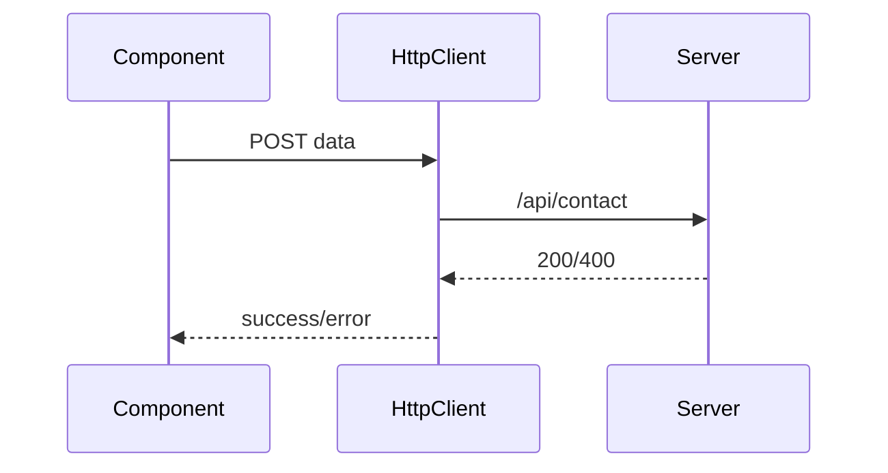

# Submitting Forms to APIs and Form State Management

## Learning Objectives

- Submit forms to REST APIs using `HttpClient`
- Manage pending, success, and error states
- Provide UX feedback and disable inputs while submitting

## Overview

- Use `pending` flags and `finally` blocks for robust state handling
- Display server validation errors under the corresponding fields

## Code Examples

### Form Submission

```ts
import { Component, inject } from '@angular/core';
import { FormBuilder, Validators } from '@angular/forms';
import { HttpClient } from '@angular/common/http';

@Component({
  selector: 'app-contact',
  standalone: true,
  template: `
    <form [formGroup]="form" (ngSubmit)="submit()">
      <input formControlName="name" />
      <input formControlName="email" />
      <textarea formControlName="message"></textarea>
      <button [disabled]="form.invalid || pending" type="submit">Send</button>
    </form>
    @if(pending){
      <p>Sending...</p>
    }
    @if(error){
      <p>{{ error }}</p>
    }
  `
})
export class ContactComponent {
  fb = new FormBuilder();
  http = inject(HttpClient);
  pending = false;
  error = '';
  form = this.fb.group({
    name: ['', Validators.required],
    email: ['', [Validators.required, Validators.email]],
    message: ['', Validators.required]
  });
  submit(){
    this.pending = true;
    this.error = '';
    this.http.post('/api/contact', this.form.value)
      .subscribe({
        next: () => this.form.reset(),
        error: () => this.error = 'Submission failed',
        complete: () => this.pending = false
      });
  }
}
```

## Practical Exercises

### Exercise

- Show field-specific server errors by mapping response to `setErrors`

### Solution

```ts
this.http.post('/api/signup', this.form.value).subscribe({
  error: (e) => {
    if(e.status === 400 && e.error?.fieldErrors){
      Object.entries(e.error.fieldErrors).forEach(([k,v]) => this.form.get(k)?.setErrors({ server: v }));
    }
  }
});
```

## Diagram



## Troubleshooting & Pitfalls

- Disable submit while pending to prevent duplicate requests
- Reset form and state after successful submission
- Map server errors to controls; avoid generic messages only

## References

- https://angular.dev/guide/http
