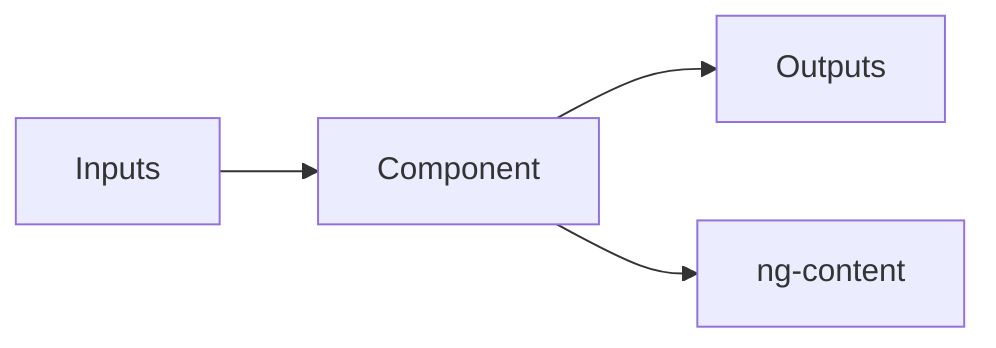

# Reusable UI Components and Patterns

## Learning Objectives

- Create reusable standalone components
- Use inputs, outputs, and content projection
- Apply OnPush change detection and host bindings

## Overview

- Encapsulate UI with inputs and outputs for composability
- Use `ng-content` for flexible slots
- Prefer `ChangeDetectionStrategy.OnPush` for performance

## Code Examples

### Card Component

```ts
import { Component, Input } from '@angular/core';

@Component({
  selector: 'app-card',
  standalone: true,
  template: `
    <section>
      <h3>{{ title }}</h3>
      <ng-content></ng-content>
    </section>
  `
})
export class CardComponent {
  @Input() title = '';
}
```

### Modal Component with Output

```ts
import { Component, EventEmitter, Output } from '@angular/core';

@Component({
  selector: 'app-modal',
  standalone: true,
  template: `
    <div class="backdrop" (click)="close.emit()"></div>
    <div class="modal">
      <ng-content></ng-content>
      <button (click)="close.emit()">Close</button>
    </div>
  `
})
export class ModalComponent {
  @Output() close = new EventEmitter<void>();
}
```

### Usage

```ts
import { Component } from '@angular/core';
import { CardComponent } from './card.component';
import { ModalComponent } from './modal.component';

@Component({
  selector: 'app-demo',
  standalone: true,
  imports: [CardComponent, ModalComponent],
  template: `
    <app-card title="Welcome">
      <p>Reusable content</p>
    </app-card>
    @if(show){
      <app-modal (close)="show=false">
        <p>Hello</p>
      </app-modal>
    }
    <button (click)="show=true">Open</button>
  `
})
export class DemoComponent {
  show = false;
}
```

## Practical Exercises

### Exercise

- Build an `AlertComponent` with `type` input and projected message
- Add `@HostBinding('class')` to style variants

### Solution

```ts
import { Component, HostBinding, Input } from '@angular/core';

@Component({ selector: 'app-alert', standalone: true, template: `<ng-content></ng-content>` })
export class AlertComponent {
  @Input() type: 'info'|'success'|'error' = 'info';
  @HostBinding('class') get cls(){ return `alert ${this.type}`; }
}
```

## Diagram



## Troubleshooting & Pitfalls

- Avoid tightly coupling components; communicate via inputs/outputs
- Keep components stateless where possible; use services for shared state
- Prefer content projection over many inputs for layout flexibility

## References

- https://angular.dev/guide/components
- https://angular.dev/guide/template-syntax
