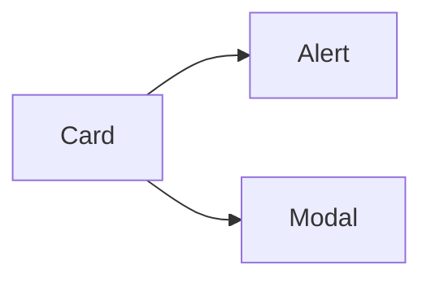

# Card, Modal, and Alert Components

## Learning Objectives

- Build reusable card, modal, and alert components
- Use content projection and outputs for interactivity
- Style variants via inputs and host bindings

## Overview

- Encapsulate UI with simple inputs and events
- Compose components to form patterns

## Code Examples

### Card

```ts
import { Component, Input } from '@angular/core';

@Component({ selector: 'app-card', standalone: true, template: `<h3>{{ title }}</h3><ng-content></ng-content>` })
export class CardComponent { @Input() title = ''; }
```

### Modal

```ts
import { Component, Output, EventEmitter } from '@angular/core';

@Component({ selector: 'app-modal', standalone: true, template: `<div class="backdrop" (click)="close.emit()"></div><div class="modal"><ng-content></ng-content><button (click)="close.emit()">Close</button></div>` })
export class ModalComponent { @Output() close = new EventEmitter<void>(); }
```

### Alert

```ts
import { Component, Input, HostBinding } from '@angular/core';

@Component({ selector: 'app-alert', standalone: true, template: `<ng-content></ng-content>` })
export class AlertComponent { @Input() type: 'info'|'success'|'error' = 'info'; @HostBinding('class') get cls(){ return `alert ${this.type}`; } }
```

## Practical Exercises

### Exercise

- Compose `Card` with an `Alert` inside and open a `Modal` on button click

### Solution

```ts
import { Component } from '@angular/core';
import { CardComponent } from './card.component';
import { AlertComponent } from './alert.component';
import { ModalComponent } from './modal.component';

@Component({ selector: 'app-demo', standalone: true, imports: [CardComponent, AlertComponent, ModalComponent], template: `<app-card title="Account"><app-alert type="info">Welcome</app-alert><button (click)="show=true">Details</button></app-card>@if(show){<app-modal (close)="show=false"><p>Details...</p></app-modal>}` })
export class DemoComponent { show = false; }
```

## Diagram



## Troubleshooting & Pitfalls

- Keep components small and focused
- Avoid business logic inside UI-only components
- Provide clear input defaults and event names

## References

- https://angular.dev/guide/components
