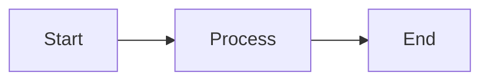

## Learning Objectives

- Understand the core ideas of Creating reusable card, modal, and alert components
- Implement a working example related to Creating reusable card, modal, and alert components
- Apply best practices and avoid common mistakes in Creating reusable card, modal, and alert components

## Key Concepts

- Overview: This topic explores Creating reusable card, modal, and alert components with hands-on examples.
- Patterns: Apply best practices appropriate to the unit focus.
- Outcomes: Build confidence through working, testable snippets.

## Technical Definitions

- Term: Concise, topic-relevant definition
- Concept: Key idea underpinning this topic
- Pattern: Repeatable solution to a common problem

## Code Examples

### Example 1: Basic HTML structure

```html
<!-- Simple HTML structure for: Creating reusable card, modal, and alert components -->
<!DOCTYPE html>
<html>
  <head>
    <meta charset="utf-8" />
    <title>Creating reusable card, modal, and alert components</title>
  </head>
  <body>
    <!-- Heading displays topic title -->
    <h1>Creating reusable card, modal, and alert components</h1>
    <!-- Content area -->
    <div id="app">Hello, world!</div>
  </body>
</html>
```

### Example 2: Basic CSS styling

```css
/* Center content and style heading */
body {
  font-family: system-ui, sans-serif;
  margin: 2rem;
}
#app {
  padding: 1rem;
  border: 1px solid #ccc;
}
h1 {
  color: #2b6cb0; /* blue */
}
```

### Example 3: Basic JavaScript logic

```javascript
// Log the topic and render simple text
const topic = 'Creating reusable card, modal, and alert components'; // topic name
console.log('Topic:', topic); // output topic

// Create and append an element to the page
function renderMessage(msg) {
  // Select container
  const el = typeof document !== 'undefined' ? document.getElementById('app') : null;
  // Render when in browser
  if (el) {
    const p = document.createElement('p'); // create paragraph
    p.textContent = msg; // set message
    el.appendChild(p); // append to app container
  } else {
    console.log('Rendered message:', msg); // fallback for Node.js
  }
}

renderMessage('Initialized Creating reusable card, modal, and alert components.');

// Expected output:
// In browser: a new <p> with text "Initialized Creating reusable card, modal, and alert components."
// In Node: 'Rendered message: Initialized Creating reusable card, modal, and alert components.'
```

## Implementation Guide

1. Review the topic requirements and prerequisites
2. Set up a minimal environment relevant to Creating reusable card, modal, and alert components
3. Implement a basic working example step-by-step
4. Test functionality and iterate on improvements
5. Document assumptions, decisions, and trade-offs
6. Reflect on performance, security, and maintainability

## Common Pitfalls

- Skipping environment setup or version mismatches
- Poor separation of concerns in code structure
- Ignoring error handling and edge cases
- Missing validation or sanitization for inputs
- Not testing cross-browser or cross-platform behavior

## Lab Session Tips

- Build incrementally; validate after each change
- Use console logs or breakpoints for visibility
- Keep examples minimal and focused
- Prefer configuration over hardcoding values
- Save working snapshots to revert easily

## Try It Yourself

1) Extend the basic example to add a new feature in Creating reusable card, modal, and alert components
2) Introduce an intentional bug and fix it via tests
3) Refactor the example to improve readability and performance

## Visual Diagram


