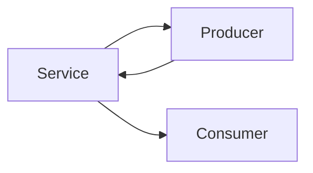

# Component Interaction with RxJS and Shared Services

## Learning Objectives

- Share state across components via services and RxJS
- React to state changes using `async` pipe
- Encapsulate interactions behind service APIs

## Overview

- Services hold shared data and expose observables
- Components subscribe via templates using `async`

## Code Examples

### Shared Service

```ts
import { Injectable } from '@angular/core';
import { BehaviorSubject } from 'rxjs';

@Injectable({ providedIn: 'root' })
export class CartService {
  private items$ = new BehaviorSubject<Array<{id:number; name:string}>>([]);
  add(item: {id:number; name:string}){ this.items$.next([...this.items$.value, item]); }
  remove(id: number){ this.items$.next(this.items$.value.filter(i => i.id !== id)); }
  select(){ return this.items$.asObservable(); }
}
```

### Producer Component

```ts
import { Component, inject } from '@angular/core';
import { CartService } from './cart.service';

@Component({ selector: 'app-products', standalone: true, template: `<button (click)="add()">Add</button>` })
export class ProductsComponent {
  cart = inject(CartService);
  add(){ this.cart.add({ id: 1, name: 'Phone' }); }
}
```

### Consumer Component

```ts
import { Component, inject } from '@angular/core';
import { CartService } from './cart.service';

@Component({ selector: 'app-cart', standalone: true, template: `@for(i of items$ | async; track i.id){ <p>{{ i.name }}</p> }` })
export class CartComponent {
  items$ = inject(CartService).select();
}
```

## Practical Exercises

### Exercise

- Add `clear()` method on `CartService` and wire a button in `CartComponent`

### Solution

```ts
clear(){ this.items$.next([]); }
```

## Diagram



## Troubleshooting & Pitfalls

- Keep service APIs small and focused
- Avoid subscribing in code-behind when `async` pipe is sufficient
- Provide services at root to share across routes, or per-route for isolation

## References

- https://angular.dev/guide/dependency-injection
- https://angular.dev/guide/rxjs
