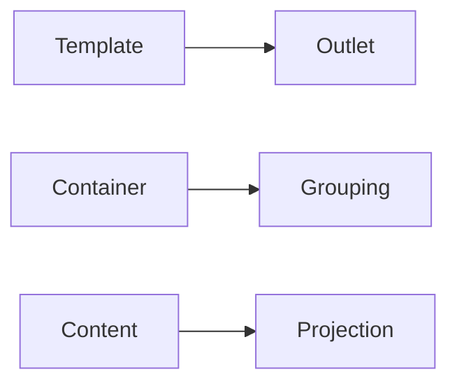

# Structural Flexibility: ng-template, ng-container, ng-content

## Learning Objectives

- Use `ng-container` and `ng-template` for structural control
- Project content with `ng-content`
- Apply built-in control flow for clean templates

## Overview

- `ng-container` groups elements without rendering a real DOM node
- `ng-template` defines template blocks for conditional or deferred rendering
- `ng-content` projects external content into a component

## Code Examples

### ng-container and Control Flow

```ts
import { Component } from '@angular/core';

@Component({ selector: 'app-list', standalone: true, template: `@if(items.length){ <ng-container>@for(i of items; track i){ <p>{{ i }}</p> }</ng-container> } @else { <p>Empty</p> }` })
export class ListComponent { items = ['A','B']; }
```

### ng-template Blocks

```ts
import { Component } from '@angular/core';

@Component({ selector: 'app-tpl', standalone: true, template: `<ng-template #row letitem><p>{{ item }}</p></ng-template>@for(i of items; track i){ <ng-container [ngTemplateOutlet]="row" [ngTemplateOutletContext]="{ $implicit: i }"></ng-container> }` })
export class TemplateExampleComponent { items = ['X','Y']; }
```

### Content Projection

```ts
import { Component } from '@angular/core';

@Component({ selector: 'app-slot', standalone: true, template: `<header><ng-content select="[slot=header]"></ng-content></header><main><ng-content></ng-content></main>` })
export class SlotComponent {}
```

## Practical Exercises

### Exercise

- Create a table component that accepts header and row templates via `ng-template`

### Solution

```ts
@Component({ selector: 'app-table', standalone: true, template: `<ng-content select="[slot=header]"></ng-content><ng-content select="[slot=row]"></ng-content>` })
export class TableComponent {}
```

## Diagram



## Troubleshooting & Pitfalls

- Use `ng-container` to avoid unnecessary wrapper elements
- Keep template references clear and scoped
- Prefer built-in `@if/@for` for clarity over complex structural directives

## References

- https://angular.dev/guide/template-syntax
