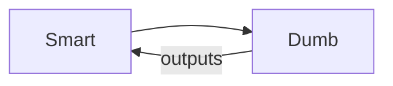

# Smart vs Dumb Components

## Learning Objectives

- Separate container logic from presentational components
- Use inputs/outputs for data flow
- Apply OnPush change detection and signals where appropriate

## Overview

- Smart components fetch data, coordinate navigation, and manage state
- Dumb components render inputs and emit outputs without side effects

## Code Examples

### Dumb Component

```ts
import { Component, Input, Output, EventEmitter } from '@angular/core';

@Component({ selector: 'app-user-list', standalone: true, template: `@for(u of users; track u.id){ <p (click)="select.emit(u)">{{ u.name }}</p> }` })
export class UserListComponent { @Input() users: Array<{id:number; name:string}> = []; @Output() select = new EventEmitter<{id:number; name:string}>(); }
```

### Smart Component

```ts
import { Component, inject } from '@angular/core';
import { HttpClient } from '@angular/common/http';
import { UserListComponent } from './user-list.component';

@Component({ selector: 'app-users', standalone: true, imports: [UserListComponent], template: `<app-user-list [users]="users" (select)="open($event)"></app-user-list>` })
export class UsersComponent {
  http = inject(HttpClient);
  users: Array<{id:number; name:string}> = [];
  constructor(){ this.http.get<Array<{id:number; name:string}>>('/api/users').subscribe(x => this.users = x); }
  open(u: {id:number; name:string}){}
}
```

## Practical Exercises

### Exercise

- Convert a monolithic component into one smart and one dumb component

### Solution

```ts
// Split rendering into child; keep data-fetching in parent
```

## Diagram



## Troubleshooting & Pitfalls

- Do not fetch data in dumb components
- Prefer immutable inputs and pure templates for dumb components
- Use signals for local UI state in dumb components

## References

- https://angular.dev/guide/components
