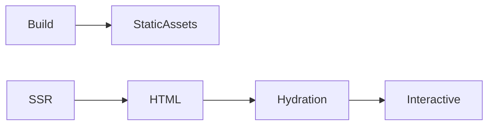

# Deployment and Performance Optimization

## Learning Objectives

- Build production bundles with Angular 17 (esbuild)
- Enable SSR and hydration for performance
- Apply runtime optimizations (OnPush, `@defer`, trackBy)

## Overview

- The CLI uses Vite dev server and esbuild for builds
- SSR improves Time to Interactive via server-rendered HTML and hydration

## Build and Deploy

```bash
ng build --configuration production
```

```bash
ng add @angular/ssr
npm run build
npm run serve:ssr
```

## Performance Techniques

```ts
import { Component, ChangeDetectionStrategy } from '@angular/core';

@Component({ selector: 'app-list', standalone: true, changeDetection: ChangeDetectionStrategy.OnPush, template: `@for(item of items; track item.id){ <p>{{ item.name }}</p> }` })
export class ListComponent { items = [{id:1,name:'A'}]; }
```

```ts
import { Component } from '@angular/core';

@Component({ selector: 'app-heavy', standalone: true, template: `@defer{ <chart></chart> } @placeholder{ <p>Loading...</p> }` })
export class HeavyComponent {}
```

## Practical Exercises

### Exercise

- Add SSR to a sample app and verify hydration by viewing page source and network

### Solution

```bash
ng add @angular/ssr
npm run serve:ssr
```

## Diagram



## Troubleshooting & Pitfalls

- Avoid direct DOM access in components when using SSR
- Use `trackBy` in lists to prevent excessive DOM updates
- Defer non-critical widgets to reduce initial payload

## References

- https://angular.dev/guide/ssr
- https://angular.dev/guide/hydration
- https://angular.dev/guide/performance
