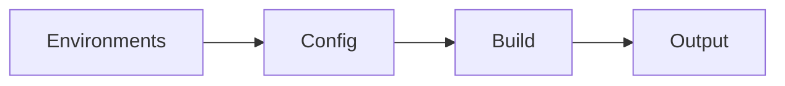

# Build Process, Environments, and Optimization Flags

## Learning Objectives

- Configure environments and build options
- Use optimization flags to reduce bundle size
- Enforce budgets and analyze output

## Overview

- Angular 17 builds with esbuild; configurations are defined in `angular.json`
- Environments store per-target variables

## Commands and Flags

```bash
ng build --configuration production
ng build --configuration staging
ng build --named-chunks --vendor-chunk=false
```

## Environments

```ts
export const environment = {
  production: true,
  api: 'https://api.example.com'
};
```

## Budgets (angular.json)

```json
{
  "budgets": [
    { "type": "initial", "maximum": "200kb" },
    { "type": "anyComponentStyle", "maximum": "6kb" }
  ]
}
```

## Practical Exercises

### Exercise

- Add a staging environment and build it
- Enable budgets and fix any violations

### Solution

```bash
ng g environments
ng build --configuration staging
```

## Diagram



## Troubleshooting & Pitfalls

- Keep environment values minimal and avoid secrets in client builds
- Use `--vendor-chunk=false` with care; measure impact
- Analyze bundles with community tools when needed

## References

- https://angular.dev/tools/cli
