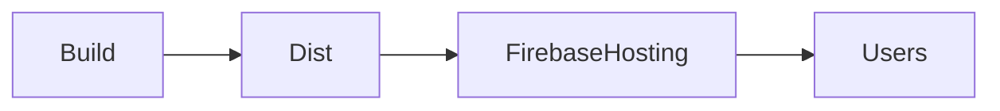

# Deploying to Firebase Hosting

## Learning Objectives

- Configure Firebase Hosting and deploy Angular builds
- Set up rewrites for SPA routing
- Manage environment variables securely

## Overview

- Firebase Hosting serves static assets from `dist/`
- Rewrites route all paths to `index.html` for SPA

## Setup and Deploy

```bash
npm install -g firebase-tools
firebase login
firebase init hosting
ng build --configuration production
firebase deploy
```

## SPA Rewrites

```json
{
  "hosting": {
    "public": "dist/your-app",
    "rewrites": [ { "source": "**", "destination": "/index.html" } ]
  }
}
```

## Practical Exercises

### Exercise

- Configure a custom domain and enforce HTTPS

### Solution

```bash
firebase hosting:sites:create your-site
```

## Diagram



## Troubleshooting & Pitfalls

- Do not commit Firebase tokens or secrets; use CLI and project settings
- Verify `public` folder points to the correct build output
- Set appropriate cache headers via Firebase config when needed

## References

- https://firebase.google.com/docs/hosting
