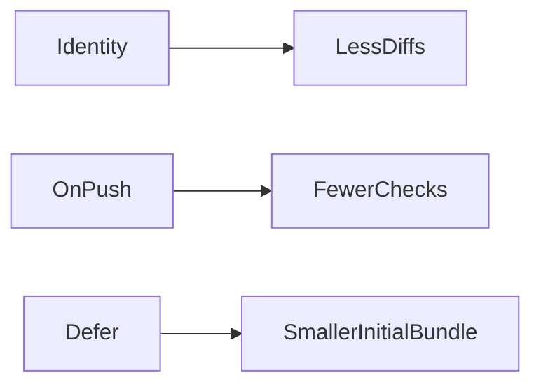

# Performance Tuning: trackBy, OnPush, Lazy Loading

## Learning Objectives

- Use `trackBy` with built-in `@for` to optimize lists
- Apply OnPush change detection for pure components
- Lazy load routes and view fragments

## Overview

- Stable identity reduces DOM churn in lists
- OnPush limits change detection to input and events
- Lazy loading reduces initial payload

## Code Examples

### trackBy with `@for`

```ts
import { Component } from '@angular/core';

@Component({ selector: 'app-items', standalone: true, template: `@for(i of items; track i.id){ <p>{{ i.name }}</p> }` })
export class ItemsComponent { items = [{id:1,name:'A'}]; }
```

### OnPush Change Detection

```ts
import { Component, ChangeDetectionStrategy, Input } from '@angular/core';

@Component({ selector: 'app-user', standalone: true, changeDetection: ChangeDetectionStrategy.OnPush, template: `<p>{{ user.name }}</p>` })
export class UserComponent { @Input() user!: {id:number; name:string}; }
```

### Lazy View with `@defer`

```ts
import { Component } from '@angular/core';

@Component({ selector: 'app-home', standalone: true, template: `@defer{ <heavy-widget></heavy-widget> } @placeholder{ <p>Loading...</p> }` })
export class HomeComponent {}
```

## Practical Exercises

### Exercise

- Add `trackBy` to an existing list and measure render behavior

### Solution

```ts
@Component({ selector: 'app-list', standalone: true, template: `@for(item of items; track item.id){ <p>{{ item.name }}</p> }` })
export class ListComponent { items = []; }
```

## Diagram



## Troubleshooting & Pitfalls

- Provide stable keys for `trackBy`; avoid using array index for mutable lists
- Ensure inputs are immutable for OnPush components
- Defer only non-critical content to preserve UX

## References

- https://angular.dev/guide/template-syntax#built-in-control-flow
- https://angular.dev/guide/performance
