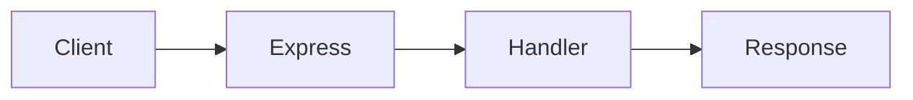
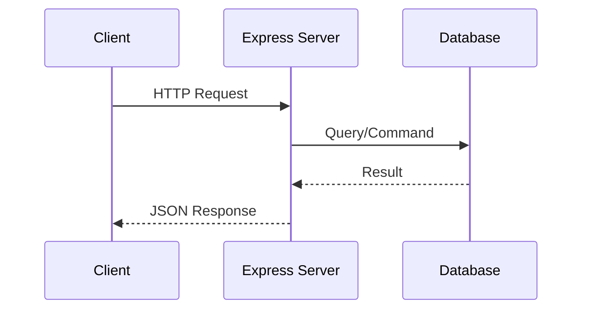

# Introduction to Node.js and Express.js

## Learning Objectives

- Understand Node 20 runtime model
- Build a minimal Express server
- Structure backend with routers and middleware

## Overview

- Node.js provides a V8-powered, event-driven runtime
- Express.js is a minimalist web framework for routing and middleware

## Code Examples

### Minimal Server

```js
import express from 'express'
const app = express()
app.get('/', (req, res) => res.send('OK'))
app.listen(3000)
```

### JSON API

```js
import express from 'express'
const app = express()
app.use(express.json())
app.post('/api/items', (req, res) => res.status(201).json(req.body))
app.listen(3000)
```

## Practical Exercises

### Exercise

- Create `/health` route returning `{ status: 'up' }`
- Add body parsing and handle POST `/echo`

### Solution

```js
app.get('/health', (req, res) => res.json({ status: 'up' }))
app.post('/echo', (req, res) => res.json(req.body))
```

## Diagram



## Troubleshooting & Pitfalls

- Ensure `type: "module"` in `package.json` when using ESM imports
- Use `express.json()` before routes to parse JSON bodies
- Return proper status codes for create/update operations

## References

- https://nodejs.org/docs/v20
- https://expressjs.com

## Learning Objectives

- Understand the core ideas of Introduction to Node.js and Express.js
- Implement a working example related to Introduction to Node.js and Express.js
- Apply best practices and avoid common mistakes in Introduction to Node.js and Express.js
- Design and test REST endpoints

## Key Concepts

- Overview: This topic explores Introduction to Node.js and Express.js with hands-on examples.
- Patterns: Apply best practices appropriate to the unit focus.
- Outcomes: Build confidence through working, testable snippets.

## Technical Definitions

- Express: Minimal web framework for Node.js
- Middleware: Functions that process requests before handlers
- REST: Architectural style for stateless APIs over HTTP

## Code Examples

### Example 1: Basic HTML structure

```html
<!-- Simple HTML structure for: Introduction to Node.js and Express.js -->
<!DOCTYPE html>
<html>
  <head>
    <meta charset="utf-8" />
    <title>Introduction to Node.js and Express.js</title>
  </head>
  <body>
    <!-- Heading displays topic title -->
    <h1>Introduction to Node.js and Express.js</h1>
    <!-- Content area -->
    <div id="app">Hello, world!</div>
  </body>
</html>
```

### Example 2: Basic CSS styling

```css
/* Center content and style heading */
body {
  font-family: system-ui, sans-serif;
  margin: 2rem;
}
#app {
  padding: 1rem;
  border: 1px solid #ccc;
}
h1 {
  color: #2b6cb0; /* blue */
}
```

### Example 3: Basic JavaScript logic

```javascript
// Log the topic and render simple text
const topic = 'Introduction to Node.js and Express.js'; // topic name
console.log('Topic:', topic); // output topic

// Create and append an element to the page
function renderMessage(msg) {
  // Select container
  const el = typeof document !== 'undefined' ? document.getElementById('app') : null;
  // Render when in browser
  if (el) {
    const p = document.createElement('p'); // create paragraph
    p.textContent = msg; // set message
    el.appendChild(p); // append to app container
  } else {
    console.log('Rendered message:', msg); // fallback for Node.js
  }
}

renderMessage('Initialized Introduction to Node.js and Express.js.');

// Expected output:
// In browser: a new <p> with text "Initialized Introduction to Node.js and Express.js."
// In Node: 'Rendered message: Initialized Introduction to Node.js and Express.js.'
```

## Implementation Guide

1. Review the topic requirements and prerequisites
2. Set up a minimal environment relevant to Introduction to Node.js and Express.js
3. Implement a basic working example step-by-step
4. Test functionality and iterate on improvements
5. Document assumptions, decisions, and trade-offs
6. Reflect on performance, security, and maintainability

## Common Pitfalls

- Skipping environment setup or version mismatches
- Poor separation of concerns in code structure
- Ignoring error handling and edge cases
- Missing validation or sanitization for inputs
- Not testing cross-browser or cross-platform behavior

## Lab Session Tips

- Build incrementally; validate after each change
- Use console logs or breakpoints for visibility
- Keep examples minimal and focused
- Prefer configuration over hardcoding values
- Save working snapshots to revert easily

## Try It Yourself

1) Extend the basic example to add a new feature in Introduction to Node.js and Express.js
2) Introduce an intentional bug and fix it via tests
3) Refactor the example to improve readability and performance

## Visual Diagram


