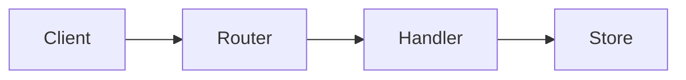
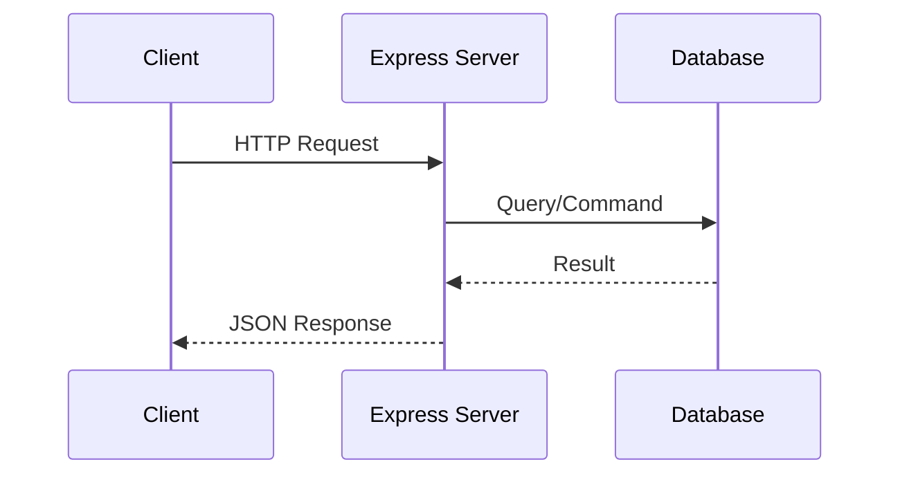

# Create a RESTful Backend with Express

## Learning Objectives

- Design REST resources
- Implement CRUD endpoints
- Return correct status codes and JSON

## Overview

- Use Express Router to organize resource routes
- Separate controller logic from routing

## Code Examples

### Router and Controller

```js
import express from 'express'
const app = express()
app.use(express.json())

const items = []
const router = express.Router()

router.get('/', (req, res) => res.json(items))
router.post('/', (req, res) => { items.push(req.body); res.status(201).json(req.body) })
router.get('/:id', (req, res) => {
  const item = items.find(i => String(i.id) === req.params.id)
  if(!item) return res.sendStatus(404)
  res.json(item)
})
router.put('/:id', (req, res) => {
  const idx = items.findIndex(i => String(i.id) === req.params.id)
  if(idx < 0) return res.sendStatus(404)
  items[idx] = req.body
  res.json(items[idx])
})
router.delete('/:id', (req, res) => {
  const idx = items.findIndex(i => String(i.id) === req.params.id)
  if(idx < 0) return res.sendStatus(404)
  items.splice(idx, 1)
  res.sendStatus(204)
})

app.use('/api/items', router)
app.listen(3000)
```

## Practical Exercises

### Exercise

- Add validation: require `id` and `name` on POST

### Solution

```js
router.post('/', (req, res) => {
  const { id, name } = req.body
  if(!id || !name) return res.status(400).json({ error: 'invalid' })
  items.push({ id, name })
  res.status(201).json({ id, name })
})
```

## Diagram



## Troubleshooting & Pitfalls

- Validate inputs and return `400` for bad requests
- Use `204` for successful deletions without body
- Keep in-memory data only for demos; persist in databases for real apps

## References

- https://expressjs.com/en/guide/routing.html

## Learning Objectives

- Understand the core ideas of Creating a RESTful backend using Express.js
- Implement a working example related to Creating a RESTful backend using Express.js
- Apply best practices and avoid common mistakes in Creating a RESTful backend using Express.js
- Design and test REST endpoints

## Key Concepts

- Overview: This topic explores Creating a RESTful backend using Express.js with hands-on examples.
- Patterns: Apply best practices appropriate to the unit focus.
- Outcomes: Build confidence through working, testable snippets.

## Technical Definitions

- Express: Minimal web framework for Node.js
- Middleware: Functions that process requests before handlers
- REST: Architectural style for stateless APIs over HTTP

## Code Examples

### Example 1: Basic HTML structure

```html
<!-- Simple HTML structure for: Creating a RESTful backend using Express.js -->
<!DOCTYPE html>
<html>
  <head>
    <meta charset="utf-8" />
    <title>Creating a RESTful backend using Express.js</title>
  </head>
  <body>
    <!-- Heading displays topic title -->
    <h1>Creating a RESTful backend using Express.js</h1>
    <!-- Content area -->
    <div id="app">Hello, world!</div>
  </body>
</html>
```

### Example 2: Basic CSS styling

```css
/* Center content and style heading */
body {
  font-family: system-ui, sans-serif;
  margin: 2rem;
}
#app {
  padding: 1rem;
  border: 1px solid #ccc;
}
h1 {
  color: #2b6cb0; /* blue */
}
```

### Example 3: Basic JavaScript logic

```javascript
// Log the topic and render simple text
const topic = 'Creating a RESTful backend using Express.js'; // topic name
console.log('Topic:', topic); // output topic

// Create and append an element to the page
function renderMessage(msg) {
  // Select container
  const el = typeof document !== 'undefined' ? document.getElementById('app') : null;
  // Render when in browser
  if (el) {
    const p = document.createElement('p'); // create paragraph
    p.textContent = msg; // set message
    el.appendChild(p); // append to app container
  } else {
    console.log('Rendered message:', msg); // fallback for Node.js
  }
}

renderMessage('Initialized Creating a RESTful backend using Express.js.');

// Expected output:
// In browser: a new <p> with text "Initialized Creating a RESTful backend using Express.js."
// In Node: 'Rendered message: Initialized Creating a RESTful backend using Express.js.'
```

## Implementation Guide

1. Review the topic requirements and prerequisites
2. Set up a minimal environment relevant to Creating a RESTful backend using Express.js
3. Implement a basic working example step-by-step
4. Test functionality and iterate on improvements
5. Document assumptions, decisions, and trade-offs
6. Reflect on performance, security, and maintainability

## Common Pitfalls

- Skipping environment setup or version mismatches
- Poor separation of concerns in code structure
- Ignoring error handling and edge cases
- Missing validation or sanitization for inputs
- Not testing cross-browser or cross-platform behavior

## Lab Session Tips

- Build incrementally; validate after each change
- Use console logs or breakpoints for visibility
- Keep examples minimal and focused
- Prefer configuration over hardcoding values
- Save working snapshots to revert easily

## Try It Yourself

1) Extend the basic example to add a new feature in Creating a RESTful backend using Express.js
2) Introduce an intentional bug and fix it via tests
3) Refactor the example to improve readability and performance

## Visual Diagram


