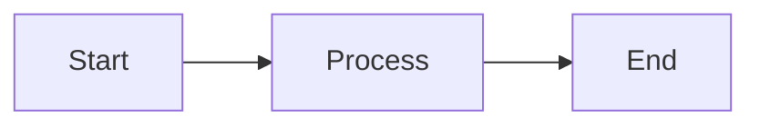

# Data Models with MongoDB & Mongoose

## Learning Objectives

- Define schemas and models
- Connect to MongoDB
- Implement CRUD operations

## Code Examples

### Connection and Model

```js
import mongoose from 'mongoose'
await mongoose.connect('mongodb://localhost:27017/shop')

const userSchema = new mongoose.Schema({
  name: String,
  email: { type: String, unique: true },
  createdAt: { type: Date, default: Date.now }
})
export const User = mongoose.model('User', userSchema)
```

### CRUD

```js
const u = await User.create({ name: 'Ada', email: 'ada@example.com' })
const list = await User.find()
const one = await User.findById(u._id)
await User.findByIdAndUpdate(u._id, { name: 'Ada L.' })
await User.findByIdAndDelete(u._id)
```

## Practical Exercises

### Exercise

- Add `Product` model with `name, price`

### Solution

```js
const productSchema = new mongoose.Schema({ name: String, price: Number })
export const Product = mongoose.model('Product', productSchema)
```

## Troubleshooting & Pitfalls

- Handle unique index errors with proper error responses
- Use schema validation for required fields

## References

- https://mongoosejs.com/docs/guide.html
- https://www.mongodb.com/docs

## Learning Objectives

- Understand the core ideas of Creating data models for users/products using MongoDB (Mongoose)
- Implement a working example related to Creating data models for users/products using MongoDB (Mongoose)
- Apply best practices and avoid common mistakes in Creating data models for users/products using MongoDB (Mongoose)

## Key Concepts

- Overview: This topic explores Creating data models for users/products using MongoDB (Mongoose) with hands-on examples.
- Patterns: Apply best practices appropriate to the unit focus.
- Outcomes: Build confidence through working, testable snippets.

## Technical Definitions

- Term: Concise, topic-relevant definition
- Concept: Key idea underpinning this topic
- Pattern: Repeatable solution to a common problem

## Code Examples

### Example 1: Basic HTML structure

```html
<!-- Simple HTML structure for: Creating data models for users/products using MongoDB (Mongoose) -->
<!DOCTYPE html>
<html>
  <head>
    <meta charset="utf-8" />
    <title>Creating data models for users/products using MongoDB (Mongoose)</title>
  </head>
  <body>
    <!-- Heading displays topic title -->
    <h1>Creating data models for users/products using MongoDB (Mongoose)</h1>
    <!-- Content area -->
    <div id="app">Hello, world!</div>
  </body>
</html>
```

### Example 2: Basic CSS styling

```css
/* Center content and style heading */
body {
  font-family: system-ui, sans-serif;
  margin: 2rem;
}
#app {
  padding: 1rem;
  border: 1px solid #ccc;
}
h1 {
  color: #2b6cb0; /* blue */
}
```

### Example 3: Basic JavaScript logic

```javascript
// Log the topic and render simple text
const topic = 'Creating data models for users/products using MongoDB (Mongoose)'; // topic name
console.log('Topic:', topic); // output topic

// Create and append an element to the page
function renderMessage(msg) {
  // Select container
  const el = typeof document !== 'undefined' ? document.getElementById('app') : null;
  // Render when in browser
  if (el) {
    const p = document.createElement('p'); // create paragraph
    p.textContent = msg; // set message
    el.appendChild(p); // append to app container
  } else {
    console.log('Rendered message:', msg); // fallback for Node.js
  }
}

renderMessage('Initialized Creating data models for users/products using MongoDB (Mongoose).');

// Expected output:
// In browser: a new <p> with text "Initialized Creating data models for users/products using MongoDB (Mongoose)."
// In Node: 'Rendered message: Initialized Creating data models for users/products using MongoDB (Mongoose).'
```

## Implementation Guide

1. Review the topic requirements and prerequisites
2. Set up a minimal environment relevant to Creating data models for users/products using MongoDB (Mongoose)
3. Implement a basic working example step-by-step
4. Test functionality and iterate on improvements
5. Document assumptions, decisions, and trade-offs
6. Reflect on performance, security, and maintainability

## Common Pitfalls

- Skipping environment setup or version mismatches
- Poor separation of concerns in code structure
- Ignoring error handling and edge cases
- Missing validation or sanitization for inputs
- Not testing cross-browser or cross-platform behavior

## Lab Session Tips

- Build incrementally; validate after each change
- Use console logs or breakpoints for visibility
- Keep examples minimal and focused
- Prefer configuration over hardcoding values
- Save working snapshots to revert easily

## Try It Yourself

1) Extend the basic example to add a new feature in Creating data models for users/products using MongoDB (Mongoose)
2) Introduce an intentional bug and fix it via tests
3) Refactor the example to improve readability and performance

## Visual Diagram


