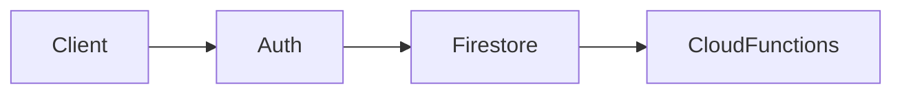

# Securing Backend Routes with Firebase Admin and JWT

## Learning Objectives

- Verify Firebase ID tokens
- Protect Express routes with middleware
- Optionally issue custom JWTs

## Code Examples

### Initialize Admin and Auth Middleware

```js
import admin from 'firebase-admin'
import express from 'express'
admin.initializeApp()
const app = express()

const auth = async (req, res, next) => {
  const h = req.headers.authorization || ''
  const t = h.startsWith('Bearer ') ? h.slice(7) : ''
  if(!t) return res.sendStatus(401)
  try { req.user = await admin.auth().verifyIdToken(t); next() } catch { res.sendStatus(401) }
}

app.get('/secure', auth, (req, res) => res.json({ uid: req.user.uid }))
app.listen(3000)
```

## Practical Exercises

### Exercise

- Add middleware to protect `/api/orders` and return user-specific data

### Solution

```js
app.get('/api/orders', auth, (req, res) => res.json({ owner: req.user.uid, items: [] }))
```

## Troubleshooting & Pitfalls

- Ensure clients send `Authorization: Bearer <token>` header
- Handle token expiration with `401` and refresh on client

## References

- https://firebase.google.com/docs/auth/admin

## Learning Objectives

- Understand the core ideas of Securing backend routes with Firebase Admin SDK and JWT
- Implement a working example related to Securing backend routes with Firebase Admin SDK and JWT
- Apply best practices and avoid common mistakes in Securing backend routes with Firebase Admin SDK and JWT
- Integrate Firebase services securely

## Key Concepts

- Overview: This topic explores Securing backend routes with Firebase Admin SDK and JWT with hands-on examples.
- Patterns: Apply best practices appropriate to the unit focus.
- Outcomes: Build confidence through working, testable snippets.

## Technical Definitions

- Firestore: NoSQL document database in Firebase
- Auth: Managed authentication via Firebase
- Admin SDK: Server-side access to Firebase services

## Code Examples

### Example 1: Basic HTML structure

```html
<!-- Simple HTML structure for: Securing backend routes with Firebase Admin SDK and JWT -->
<!DOCTYPE html>
<html>
  <head>
    <meta charset="utf-8" />
    <title>Securing backend routes with Firebase Admin SDK and JWT</title>
  </head>
  <body>
    <!-- Heading displays topic title -->
    <h1>Securing backend routes with Firebase Admin SDK and JWT</h1>
    <!-- Content area -->
    <div id="app">Hello, world!</div>
  </body>
</html>
```

### Example 2: Basic CSS styling

```css
/* Center content and style heading */
body {
  font-family: system-ui, sans-serif;
  margin: 2rem;
}
#app {
  padding: 1rem;
  border: 1px solid #ccc;
}
h1 {
  color: #2b6cb0; /* blue */
}
```

### Example 3: Basic JavaScript logic

```javascript
// Log the topic and render simple text
const topic = 'Securing backend routes with Firebase Admin SDK and JWT'; // topic name
console.log('Topic:', topic); // output topic

// Create and append an element to the page
function renderMessage(msg) {
  // Select container
  const el = typeof document !== 'undefined' ? document.getElementById('app') : null;
  // Render when in browser
  if (el) {
    const p = document.createElement('p'); // create paragraph
    p.textContent = msg; // set message
    el.appendChild(p); // append to app container
  } else {
    console.log('Rendered message:', msg); // fallback for Node.js
  }
}

renderMessage('Initialized Securing backend routes with Firebase Admin SDK and JWT.');

// Expected output:
// In browser: a new <p> with text "Initialized Securing backend routes with Firebase Admin SDK and JWT."
// In Node: 'Rendered message: Initialized Securing backend routes with Firebase Admin SDK and JWT.'
```

## Implementation Guide

1. Review the topic requirements and prerequisites
2. Set up a minimal environment relevant to Securing backend routes with Firebase Admin SDK and JWT
3. Implement a basic working example step-by-step
4. Test functionality and iterate on improvements
5. Document assumptions, decisions, and trade-offs
6. Reflect on performance, security, and maintainability

## Common Pitfalls

- Skipping environment setup or version mismatches
- Poor separation of concerns in code structure
- Ignoring error handling and edge cases
- Missing validation or sanitization for inputs
- Not testing cross-browser or cross-platform behavior

## Lab Session Tips

- Build incrementally; validate after each change
- Use console logs or breakpoints for visibility
- Keep examples minimal and focused
- Prefer configuration over hardcoding values
- Save working snapshots to revert easily

## Try It Yourself

1) Extend the basic example to add a new feature in Securing backend routes with Firebase Admin SDK and JWT
2) Introduce an intentional bug and fix it via tests
3) Refactor the example to improve readability and performance

## Visual Diagram


